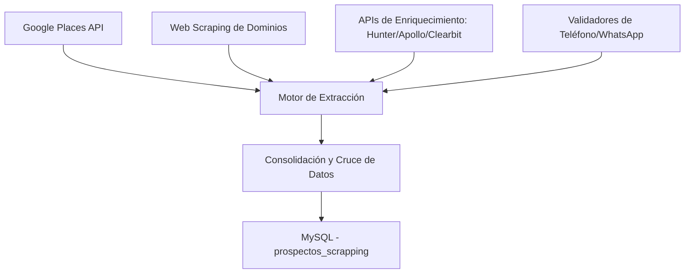

# Extractor Inteligente Enriquecido

Esta habilidad define las directrices, arquitecturas de integración y estrategias de enriquecimiento para llevar el extractor de leads (`extractor_inteligente.py`) a su máxima capacidad de prospección y recolección de datos comerciales.

## 1. Visión y Objetivo
El objetivo es transformar el extractor actual (basado únicamente en Google Places) en un motor híbrido de inteligencia comercial que extraiga, valide, cruce y enriquezca cada prospecto con datos de contacto directos, redes sociales, tecnologías web y tamaño de empresa.

## 2. Estrategias de Cruce y Enriquecimiento de Datos

### A. Extracción de Sitios Web (Scraping de Primer Nivel)
Cuando Google Places proporciona un dominio web (URL):
- **Descubrimiento de Correos y Redes**: Rastrear la página de inicio, contacto y "quiénes somos" buscando:
  - Patrones de correo electrónico (`@[a-zA-Z0-9.-]+\.[a-zA-Z]{2,}`)
  - Enlaces a perfiles de redes sociales (LinkedIn, Facebook, Instagram, Twitter/X)
  - Enlaces de chat directo a WhatsApp.

### B. Integración con APIs de Enriquecimiento
1. **Enriquecimiento de Correos y Personas (Hunter.io / Apollo.io)**:
   - Utilizar el dominio web para buscar correos corporativos asociados.
   - Identificar nombres de tomadores de decisiones (Directores, Compras, Logística).
2. **Datos Corporativos y Tecnologías (Clearbit / BuiltWith)**:
   - Identificar tamaño de la empresa, ingresos estimados, industria detallada y tecnologías que utiliza su sitio web.

### C. Verificación y Limpieza de Teléfonos
- **Validación de WhatsApp**: Integrar APIs de verificación de números telefónicos o gateways de WhatsApp (como Baileys, WPPConnect o APIs comerciales) para marcar si el número tiene una cuenta de WhatsApp activa.
- **Normalización**: E.164 (`+52...` para México).

## 3. Arquitectura del Script Potenciado
El script debe estructurarse de la siguiente manera:
1. **Orquestador**: Controla el flujo diario, rotación de ciudades/industrias y distribución de cuotas de APIs.
2. **Módulo de Extracción Base**: Consulta Google Places.
3. **Módulo de Enriquecimiento**:
   - `class DomainScraper`: Scraping asíncrono y ligero.
   - `class EmailFinderAPI`: Interfaz con APIs externas (Hunter/Apollo).
4. **Módulo de Base de Datos**: Inserción eficiente con soporte para actualizaciones (`ON DUPLICATE KEY UPDATE`) para no perder datos previos al enriquecer.

## 4. Instrucciones para la Implementación de Mejoras
- **Asincronía**: Utilizar `httpx` y `asyncio` en Python para el scraping web rápido de dominios encontrados, evitando cuellos de botella.
- **Manejo de Errores y Rate Limiting**: Implementar reintentos con retroceso exponencial (*exponential backoff*) y respetar límites de rate de cada API.
- **Seguridad de Credenciales**: Cargar todas las llaves de API desde variables de entorno (`.env`).
